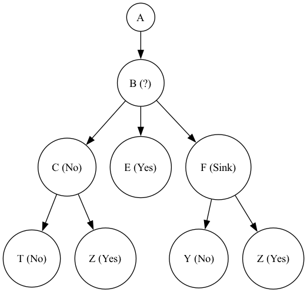

# Event Pipeline

## Introduction
This library provides an easy-to-use framework for defining and managing events and pipelines. 
It allows you to create events, process data through a series of tasks, and manage complex workflows
with minimal overhead. The library is designed to be extensible and flexible, enabling developers to 
easily integrate it into their projects.

## Features
- Define and manage events and pipelines in Python.
- Support for conditional task execution.
- Easy integration of custom event processing logic.
- Supports remote task execution and distributed processing.
- Seamless handling of task dependencies and event execution flow.

## Installation
To install the library, simply use pip:

```bash
pip install event_pipeline
```

# Usage

## Define Pipeline

To define a pipeline, import the Pipeline class from the event_pipeline module and create a new class that
inherits from it. This custom class will define the behavior and structure of your pipeline.

```python
from event_pipeline import Pipeline

class MyPipeline(Pipeline):
    # Your input data fields will go here
    pass

```

## Defining Input Data Field
Import the `InputDataField` or another class from the fields module. 

The InputDataField class is used to define the input fields for your pipeline. These fields are assigned as attributes 
within your pipeline class and represent the data that will flow through the pipeline.
Events within the pipeline can request for the values of the Input fields by including the name 
of the field in their `process` method arguments.

```python
from event_pipeline import Pipeline
from event_pipeline.fields import InputDataField

class MyPipeline(Pipeline):
    # Define input fields as attributes
    input_field = InputDataField(data_type=str, required=True)  # Define an input field

```

## Defining Pipeline Structure
The next step is to define the structure and flow of your pipeline using the pointy language. 
The pointy file provides a structured format to describe how the pipeline should execute, 
including the order of tasks, conditions, and dependencies.

```pty
Fetch->Process->Execute->SaveToDB->Return
```

The pointy file `.pty` describes the flow of tasks and their dependencies, allowing you to build dynamic 
and conditional pipelines based on the results of previous executed event.

By default, if the name of your pointy file matches the name of your pipeline class, the library 
will automatically load the pointy file for you. For example, if your class is named MyPipeline, 
it will automatically look for a file named `MyPipeline.pty`.

If you want to use a pointy file with a different name, you can define a Meta subclass inside 
your pipeline class. 

This subclass should specify the file or pointy property:

- `pointy`: The string of the pointy script.
- `file`: The full path to your pointy file.

Example of how to define the Meta subclass:
```python
class MyPipeline(Pipeline):
    class Meta:
        pointy = "A->B->C"  # Pointy script
        # OR
        file = "/path/to/your/custom_pipeline.pty"  # Full path to your pointy file

# You can also define the options as dictionary

class MyPipeline(Pipeline):
    meta = {
        "pointy": "A->B->C",
        # OR
        "file": "/path/to/your/custom_pipeline.pty"
    }
```

# Pointy Language

- Single event: 

```pty
A    # single event
```

- Directional operation

```pty
A -> B   # Execute A then move to B
```

- Two events with result piping

```pty
A |-> B   # Piping result of execution of A to event B
```

- Multiple events with branching

```pty
A -> B (0 -> C, 1 -> D) # 0 for failure, 1 for success 
```

- Multiple events with sink

```pty
A (0 -> B, 1 -> C) -> D
```

# Example

```pty
A -> B (
    0->C (
        0 |-> T,
        1 -> Z
    ),
    1 -> E
) -> F (
    0 -> Y,
    1 -> Z
)
```
This is the graphical representation of the above pipeline



To draw your pipeline:
```python
# instantiate your pipeline clas
pipeline = MyPipeline()

# draw ascii representation
pipeline.draw_ascii_graph()

# draw graphical representation # (requires graphviz, xdot)
pipeline.draw_graphviz_image(directory=...)

```

# Defining Events

## Define the Event Class

To define an event, you need to inherit from the EventBase class and override the process method. 
This process method defines the logic for how the event is executed.

```python
from event_pipeline import EventBase

class MyEvent(EventBase):
    def process(self, *args, **kwargs):
        # Event processing logic here
        return True, "Event processed successfully"
```

## Specify the Executor for the Event

Every event must specify an executor that defines how the event will be executed. Executors are 
responsible for managing the concurrency or parallelism when the event is processed.

Executors implement the Executor interface from the concurrent.futures._base module in the 
Python standard library. If no executor is specified, the DefaultExecutor will be used by default.

```python
from concurrent.futures import ThreadPoolExecutor

class MyEvent(EventBase):
    executor = ThreadPoolExecutor  # Specify executor for the event
    
    def process(self, *args, **kwargs):
        # Event processing logic here
        return True, "Event processed successfully"

```

If you are using `ProcessPoolExecutor` or `ThreadPoolExecutor`, you can configure additional properties
to control the behavior of the executor:

- `max_workers`: Specifies the maximum number of workers (processes or threads) that can be used to 
execute the event. If not provided, the number of workers will default to the number of processors on the machine.

- `max_tasks_per_child`: Defines the maximum number of tasks a worker can complete before being replaced with a 
fresh worker. By default, workers will live as long as the executor unless this property is set.

- `thread_name_prefix`: A prefix to use for naming threads. This helps identify threads related to your event during execution.

Here’s how you can set these properties:

```python
from concurrent.futures import ThreadPoolExecutor

class MyEvent(EventBase):
    executor = ProcessPoolExecutor
    
    # Configure the executor
    max_workers = 4  # Max number of workers
    max_tasks_per_child = 10  # Max tasks per worker before replacement
    thread_name_prefix = "my_event_executor"  # Prefix for thread names
    
    def process(self, *args, **kwargs):
        # Event processing logic here
        return True, "Event processed successfully"

```


# Contributing
We welcome contributions! If you have any improvements, fixes, or new features, feel free to fork the repository and create a pull request.

# License
This project is licensed under the GNU License - see the LICENSE file for details.